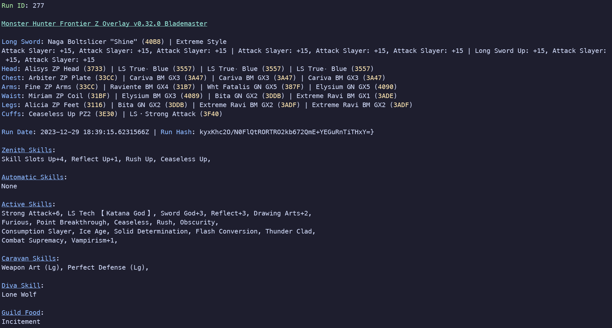

# mhfz-run-viewer

A CLI program for viewing run data from mhfz-overlay databases.

This does not do any validation, but instead is used for visualization.

## Requirements

- A SQLite database file from the latest mhfz-overlay version.

- Node.js

## Dependencies

`npm install inquirer sqlite3 chalk terminal-link ezlion`

## Usage

1. Place the database file in the same directory as the program.
2. Run `node mhfz-run-viewer.js` and follow the prompts.
