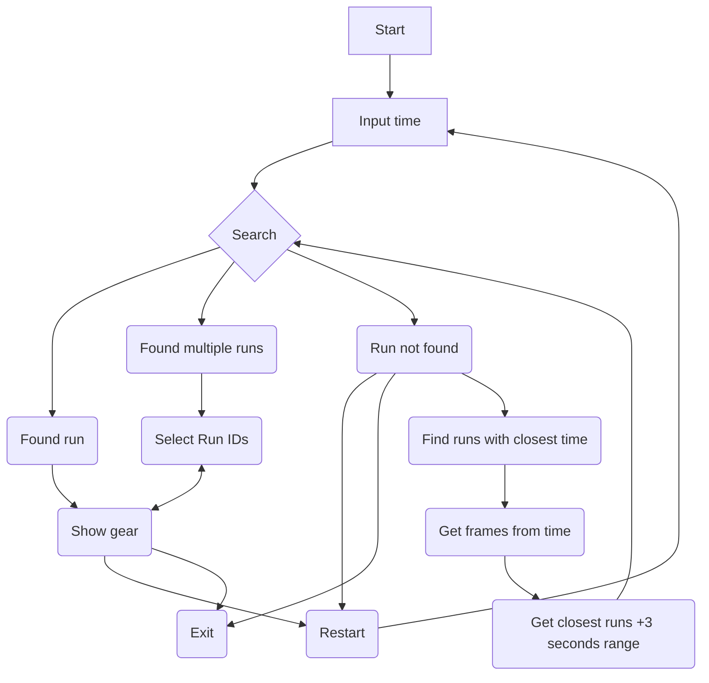

# Documentation

## Program flow

```mermaid
flowchart TD
    A[Start] --> input[Input time]
    input-->search{Search}
    search --> C(Found run)
    search -->D(Found multiple runs)
    search-->E(Run not found)
    C-->F(Show gear)
    F-->restart(Restart)
    F--> exit(Exit)
    restart-->input
    D-->G(Select Run IDs)
    G<-->F
    E-->restart
    E-->exit
    E-->H(Find runs with closest time)
    H-->I(Get frames from time)
    I-->J(Get closest runs +3 seconds range)
    J-->search

```
